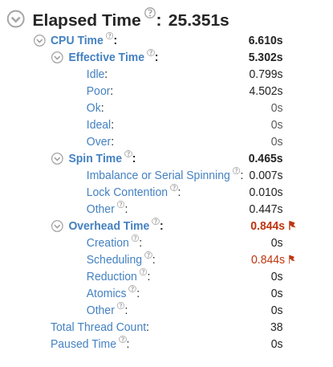
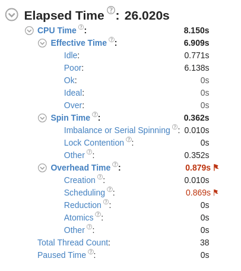

# Computer Pointer Controller

This codebase provides the funcitonality of controlling the screen's mouse pointer using gaze. It involves detection a face and then building facial landmarks and constructing head pose from that to finally determine gaze. It can work using either a video file or using user input from a webcam.

## Project Set Up and Installation

- Install openvino toolkit

- Clone the repo or download and unzip the file

- cd <repo_path>

- Download the following models into the **intel** directory shown below using the openvino model downloader

  - <pre><code>python3 /opt/intel/openvino/deployment_tools/tools/model_downloader/downloader.py --name "face-detection-adas-binary-0001"</code></pre>
  - <pre><code>python3 /opt/intel/openvino/deployment_tools/tools/model_downloader/downloader.py --name "landmarks-regression-retail-0009"</code></pre>
  - <pre><code>python3 /opt/intel/openvino/deployment_tools/tools/model_downloader/downloader.py --name "head-pose-estimation-adas-0001"</code></pre>
  - <pre><code>python3 /opt/intel/openvino/deployment_tools/tools/model_downloader/downloader.py --name "gaze-estimation-adas-0002"</code></pre>

- Source the openvino environment using:

<pre><code>source /opt/intel/openvino/bin/setupvars.sh -pyver 3.5</code></pre>

- If you choose to use a virtual environment:
  - <pre><code>conda create -n {name} python=3.6</code></pre>
  - <pre><code>conda activate {name}</code></pre>
  - <pre><code>pip install -r requirements.txt</code></pre>

## Demo

- cd <repo_path>

- Run the main.py file:

  <pre><code>python3 src/main.py \
  -f /path/to/facedetectionmodel \
  -ldm /path/to/facelandmarkmodel \
  -p /path/to/headposemodel \ 
  -g /path/to/gazemodel \
  -i 'bin/demo.mp4'
  </code></pre>

  Here is an example:

  <pre><code>python3 src/main.py -f /home/usr/Desktop/starter/intel/face-detection-adas-binary-0001/FP32-INT1/face-detection-adas-binary-0001. -ldm /home/usr/Desktop/starter/intel/landmarks-regression-retail-0009/FP32/landmarks-regression-retail-0009. -p /home/usr/Desktop/starter/intel/head-pose-estimation-adas-0001/FP32/head-pose-estimation-adas-0001. -g /home/usr/Desktop/starter/intel/gaze-estimation-adas-0002/FP32/gaze-estimation-adas-0002. -i 'bin/demo.mp4' -d 'CPU' -view False
  
  </code></pre>

## Documentation

These are the command line arguments accepted:

- -h: Get info about the arguments
- -f: Face Detection Model path
- -ldm: Facial Landmark Detection Model path
- -p: Pose Detection Model path
- -g: Gaze Detection Model path
- -i: Either the path to a video file or 'cam'
- -d: Device - CPU by default
- -e: Options for extensions for unsupported layers
- -view: enable visualizations
- -as: Enable / Disable Asynchronous Inference

Directory Overview:

- bin
  - demo.mp4: Test video file
- intel
  - stores all model files and folders
- media
  - images for benchmarks and analysis
- requirements.txt
  - Will need these packages to run the application
- src
  - face_detection.py: Preprocess inputs / outputs and performs inference on input video stream
  - facial_landmarks_detection.py: Preprocess inputs / outputs and identifies 5 facial landmarks (eyes, nose, mouth)
  - head_pose_estimation.py: Preprocess inputs / outputs and determines head pose (yaw, pitch, roll)
  - gaze_estimation.py: Preprocess inputs / outputs and determines gaze
  - input_feeder.py: Initializes the input stream and sends frames to rest of pipeline
  - mouse_controller.py: Controls the mouse pointer based on (x,y) output from gaze estimation
  - visualize_output.py: Visualizes intermediate steps

## Results

Results for inference and load time for FP32 precision running on an Intel CPU i7-6500U are in the stats.txt file and summarized below.

**Inference time and Accuracy Comparisons for different precision**

As can be seen above, the load and inference times do not vary much between precisions, but do vary a fair amount between models. The Face Detection Model is by far the most demanding since it s load time is nearly twice that of the others and the inference and several orders greater. Clearly this is the bottleneck in the application and ongoing work is being done to try and optimize this initial part of the pipeline.

As for accuracy, the ideal way would have been to compare the FP32 and FP16 confidence values for the face detection model. However, since that was only in FP32, two other methods were attempted. Firstly, the facial landmark pixel locations were recorded for FP32 and FP16 with the FP32 values taken as ground truth since this is running on a CPU. Then the difference in location of the landmarks were measured for the first 15 frames. While there was no difference in the eyes and mouth, there was an occasional difference in pixel location by a maximum difference of 2 pixels for the nose of the FP16 precision. This was double checked using the visualization option and is fortunately not discernable to the human eye. Another method that was tried was to utilize this similar approach but for the final output of the application, which is the gaze vector. For the first 15 frames, the (x,y) values were recorded and compared using simple Euclidean distances with FP32 as the ground truth. This approach managed to show little more of a discernable difference for these relative position values. This amounts to an average difference in (x,y) values of approximately (3.15e-5,3.06e-5). Hence, such small difference in relative distance would rarely be noticeable to the naked eye. Hence, the precision reduction does not seem to reduce accuracy. Attempting this on other hardware platforms would yield more interesting results.

### Async Inference

The application has an option to enable / disable async inference mode. Performance using these two methods was measured using the VTune Profiler and tested on my local CPU - Intel i7 6500U. The same video file was used to test both instances.

**Async Performance Results**

**Without Async Performance Results**

Async seems to be more efficient as it can shave off nearly a whole second of processing time for the entire video and would definitely make an impact for longer videos. It utilized the CPU for more than a whole second less as well because while it was idle for approximately the same time, it was utilized poorly for nearly two seconds less. Further software optimizations can help to reduce this.
However, the spin time is slightly higher by about 100ms.

### Edge Cases

If more than one face is detected, it takes the face with highest detected probability

Sometime the facial landmarks detector won't be able to pick up landmarks if angles are too extreme or one eye is hidden behind the other in case of a complete side angle. In this case, the app will exit cleanly.
